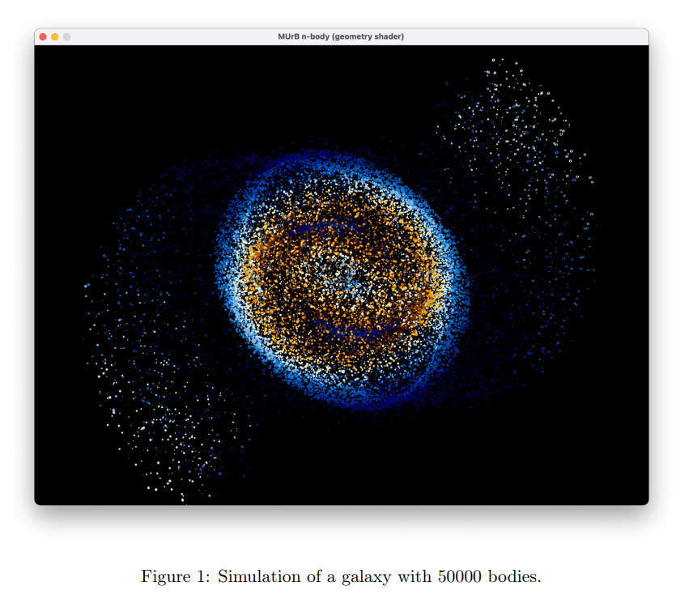

## Projet MUrB - Simulation N-Body

Optimization of a celestial body motion simulator (N-Body problem) as part of the PACC course at the Sorbonne University.

PACC : Parallelism and Accelerators for Cluster Computing

#### 👥 Team
- @Finsch (jo)
- @abporsche (dino)
- @mouad-zouhdi (momo)

#### 📁 Project Structure
- src/murb/implem/: Implementations of different versions
- src/test/implem/: Unit tests

#### 🎯 Goals
- [ ] Optimized sequential implementation
- [ ] SIMD version with MIPP
- [ ] Multi-threaded OpenMP version
- [ ] GPU version (CUDA)
- [ ] Heterogeneous version